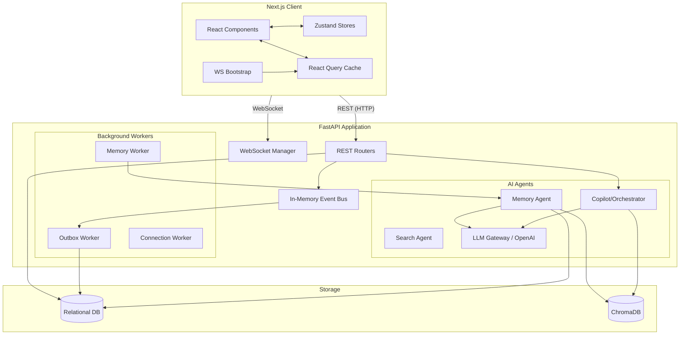

# MemoryChat Architecture

## 1. System Overview

MemoryChat is an AI-powered P2P messaging platform designed to facilitate real-time communication while leveraging AI to extract relationship insights, summarize conversations, and suggest interactions. The system consists of a FastAPI backend using PostgreSQL/SQLite, a real-time WebSocket layer for live updates, a background worker ecosystem implementing the Transactional Outbox pattern, and a React/Next.js frontend using React Query and Zustand. AI capabilities are driven by LangChain (Copilot) and specialized agents that interact with a ChromaDB vector store.

## 2. High-Level Component Architecture

## 3. Frontend Architecture

- **Framework**: Next.js (React) with TailwindCSS.
- **State Management**: Zustand for global client state (e.g., `auth-store`, `conversation-store`).
- **Data Fetching**: `@tanstack/react-query` handles REST API requests, caching, and optimistic updates.
- **Real-time Sync**: Global `ws-bootstrap.tsx` component maintains the WebSocket connection. Incoming WS events directly mutate the React Query cache (e.g., pushing new messages, soft-deleting recalled messages) without triggering full network refetches.

## 4. Backend Architecture

- **Framework**: FastAPI (Uvicorn).
- **Database ORM**: SQLAlchemy 2.0 with Alembic for migrations.
- **Event-Driven Lifecycle**:
  - The application relies heavily on an `EventBus` injected into the app state during startup (`main.py`).
  - Critical actions (like sending a message) publish events to the `EventBus`.
  - The `OutboxWorker` ensures reliable event publishing by tracking events in the `outbox_events` table (Transactional Outbox pattern).
- **Workers**: Long-running asynchronous loops (`MemoryWorker`, `ConnectionRecommendationWorker`) subscribe to the `EventBus` to offload heavy AI tasks.

## 5. Database / Data Model Relationships

The relational data model centers around `Users` and their `Conversations`/`Contacts`.

- **Users**: Core entity (`users`), linked to `UserProfile`, `Setting`, `Notification`, and `SearchHistory`.
- **Conversations & Messages**: `direct_conversations` connects two users (`user_a_id`, `user_b_id`). `messages` belong to a conversation and a sender. `conversation_user_state` tracks read receipts and mute/archive states per user.
- **Contacts**: `contacts` belongs to one user (owner) and links to a conversation. It holds manual notes and basic info.
- **AI Memory**:
  - `contact_memories`: 1:1 with `contacts`. Stores AI-extracted skills, interests, and relationship scores.
  - `assistant_memories`: 1:1 with `(user, conversation)`. Stores conversation summaries and facts.
- **Recommendations**: `recommendations` track actionable AI suggestions (FOLLOWUP, REPLY, CONNECTION, PRIORITY).
- **System**: `outbox_events` for the event bus, `event_logs` for user analytics.

## 6. Authentication and Authorization Flow

- **REST API**: JWT-based Bearer authentication.
- **WebSocket**: Uses a short-lived ticket-based system (`GET /ws/chat?ticket=...`). The ticket is validated against the database to identify the user before upgrading the connection.
- **Data Access**: Endpoints and services enforce strict ownership validation (e.g., returning 403 if a user attempts to recall a message they did not send or access a conversation they are not part of).

## 7. Connection Request Flow

- Modeled in the `connection_requests` table.
- A user sends a request to another user (status `PENDING`).
- The receiver can accept (status `ACCEPTED`), which logically creates a connection/contact, or reject (`REJECTED`).

## 8. Conversation and Participant Model

- Currently, the system implements **Direct (P2P) Conversations** only.
- A `Conversation` explicitly defines `user_a_id` and `user_b_id`.
- There is no abstract "Participant" pivot table for Group chats implemented yet.

## 9. Message Lifecycle

1. **Creation**: Client calls `POST /messages`. 
2. **Persistence**: Service creates the `Message` record and updates the `Conversation`'s `last_message` fields.
3. **Broadcasting**: Service calls `wsManager.broadcast_to_conversation` and publishes an `OutboxEvent` (e.g., `SEND_MESSAGE`).
4. **Recall**: Client calls `DELETE /messages/{id}`. The service sets `deleted_at`, commits, and broadcasts a `MESSAGE_RECALLED` event.
5. **Background Processing**: The `MemoryWorker` intercepts `SEND_MESSAGE` events. If the conversation has been idle for >5 minutes, it triggers an AI memory refresh.

## 10. WebSocket Architecture and Event Flow

- **Manager**: `ConnectionManager` (`src/ws/manager.py`) stores active `WebSocket` objects in memory, mapped by `user_id`.
- **Communication Pattern**: Unidirectional for payload delivery (Server -> Client). The client uses REST POST to send data, and the WebSocket merely receives broadcasted events (e.g., `NEW_MESSAGE`, `MESSAGE_RECALLED`).
- **Keep-Alive**: Client timeouts are handled via a Ping/Pong loop within the `chat_websocket` endpoint.

## 11. AI Architecture

- **Copilot Orchestrator**: Located in `src/agents/orchestrator.py`. Instead of a complex LangGraph state machine, it uses LangChain's `bind_tools` to dynamically invoke tools (Semantic Search, Get Recent Messages, Get Peer Info, Suggest Reply).
- **Background Extraction**: `MemoryWorker` extracts facts and summaries asynchronously and stores them in `AssistantMemory` and `ContactMemory`.
- **Recommendations**: `ConnectionRecommendationWorker` analyzes memories to generate actionable `Recommendation` records.

## 12. RAG / ChromaDB Data Flow

- Handled by `VectorStoreService`.
- **Ingestion**: When `MemoryWorker` generates an `AssistantMemory`, it concatenates the summary and facts, embeds them via OpenAI, and upserts them into ChromaDB.
- **Retrieval**: The `SearchAgent` (invoked by Copilot's `semantic_search` tool) queries ChromaDB to find historically relevant conversations and matches them against `UserProfile` data to return context-rich results.

## 13. Important API Boundaries

- `src.api.v1`: External REST endpoints (FastAPI routers).
- `src.services`: Business logic layer. Controllers must not perform database commits directly; they delegate to services.
- `src.gateways`: Wrappers for external services (e.g., `LLMGateway` for OpenAI).
- `src.agents`: AI reasoning and logic isolation.

## 14. Important Frontend State/Query Boundaries

- **Zustand**: Handles UI states like "which conversation is actively selected" (`activeConversationId`) and authentication state.
- **React Query**: Owns server-state (the actual messages, conversation lists, search results).
- **WebSocket Bootstrap**: Bridges the gap by mutating the React Query cache when server-state changes unexpectedly (via Push).

## 15. Important Data Flows

1. **Transactional Outbox**: REST Request -> DB Transaction (Entity + OutboxEvent) -> EventBus -> Background Worker -> AI Processing. This guarantees AI agents eventually process messages even if the worker temporarily crashes.
2. **Real-time Sync**: REST Request -> DB Transaction -> In-Memory WebSocket Manager -> React Query Cache `setQueryData`.

## 16. Production / Deployment Architecture

- Dockerized deployment via `docker-compose.yml`.
- Combines the FastAPI Uvicorn process, Postgres/SQLite, and potentially ChromaDB in isolated containers.
- PM2 / Node.js standard deployment for the Next.js frontend.

## 17. Known Architectural Constraints

- **In-Memory WebSockets**: `ConnectionManager` stores connections in local RAM. The system cannot currently scale horizontally to multiple FastAPI pods without dropping WS messages, as it lacks a Redis Pub/Sub backplane.
- **ChromaDB Local File**: If ChromaDB is configured to run locally via file persistence rather than a dedicated server, horizontal scaling of the backend will lead to vector database locks/inconsistencies.
- **P2P Constraint**: The database schema (`user_a_id`, `user_b_id`) prevents multi-user group chats without a schema migration.

## 18. Important Invariants That Must Not Be Violated

- **Message Immutability/Recalls**: Messages are never hard-deleted. They must be soft-deleted using `deleted_at`.
- **Ownership Checks**: Any mutable action on a User, Message, or Conversation MUST verify that the requesting `user_id` matches the owner of the resource.
- **Outbox Integrity**: Business events must be written to `outbox_events` in the same SQL transaction as the domain entity changes.

---

## Architectural Findings & Drift Analysis

### Documentation Inconsistencies Found
- **LangGraph Drift**: The `README.md` and initial specs state that the system relies on a "LangGraph Orchestrator" and "LangGraph AI Agents". However, `src/agents/orchestrator.py` actively implements a `DummyGraph` and explicitly bypasses LangGraph, utilizing standard LangChain `bind_tools` logic for Copilot reasoning. 
- **WebSocket Bi-directionality**: While typical WS chat apps are bi-directional, `src/api/ws.py` enforces a one-way (Server-to-Client) payload delivery model. The code explicitly comments: "WS is now one-way. Client must use POST /messages to send."

### Architectural Risks
1. **Vertical Scaling Bottleneck**: The combination of In-Memory `ConnectionManager` and In-Memory `EventBus` means the backend is strictly limited to a single instance/process.
2. **Blocking Operations**: Some AI tools (like `get_peer_info` inside `orchestrator.py`) manually manage `SessionLocal()` DB connections instead of utilizing injected sessions, risking connection leaks if exceptions occur before the `finally` block or if the pool is exhausted.

### Areas Requiring Human Decisions
- **Scaling Strategy**: Decide if the system will integrate Redis (for WS Pub/Sub and Celery/EventBus queues) to enable horizontal scaling.
- **Agent Framework**: Decide whether to fully migrate back to LangGraph for complex stateful agent workflows or officially deprecate it in favor of the current LangChain Tool-Calling implementation.
