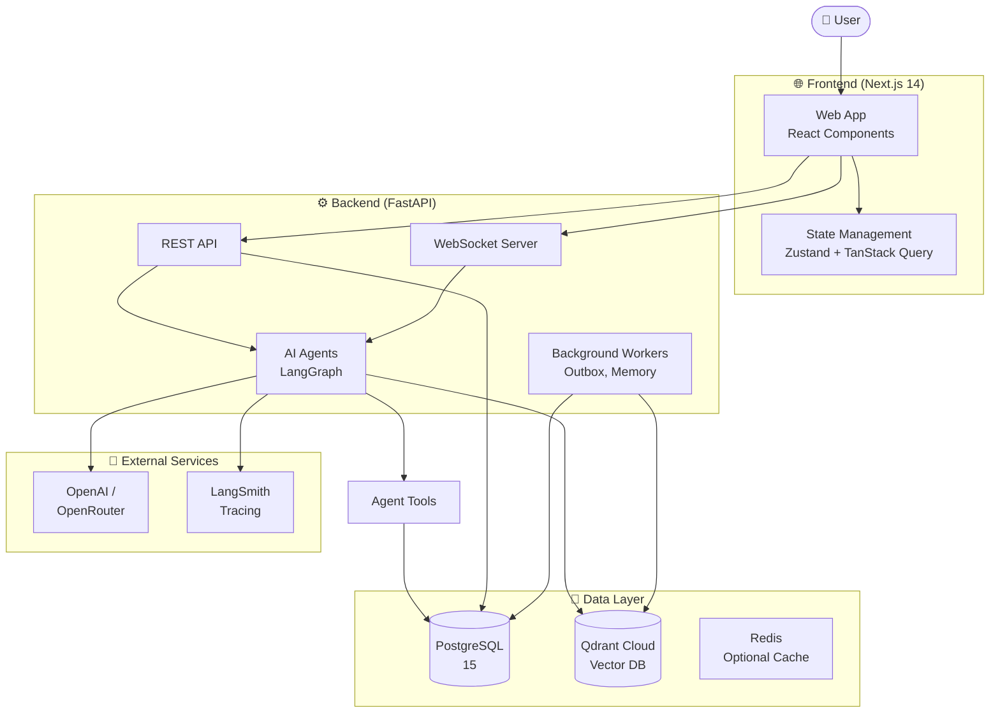
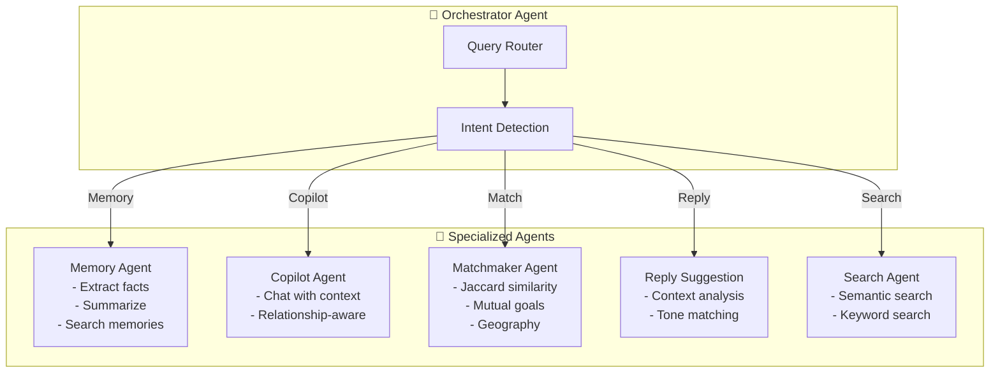
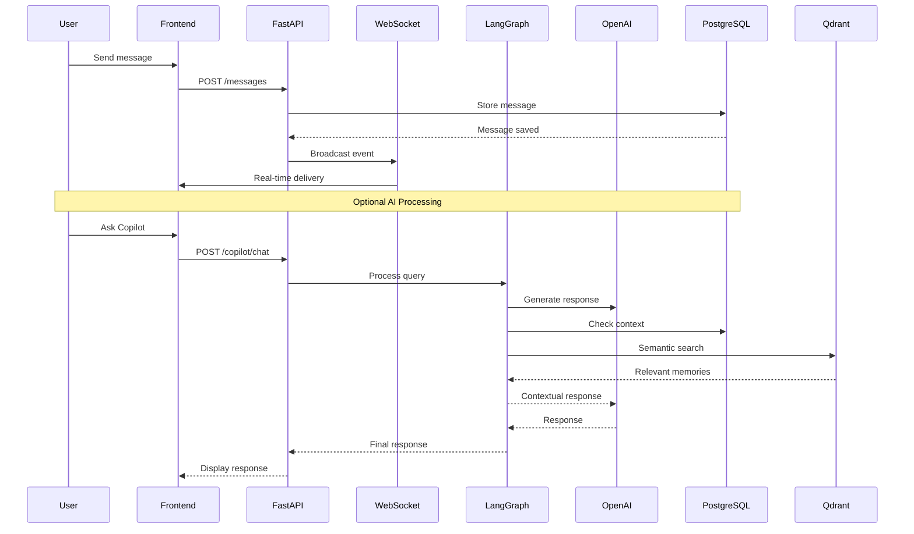
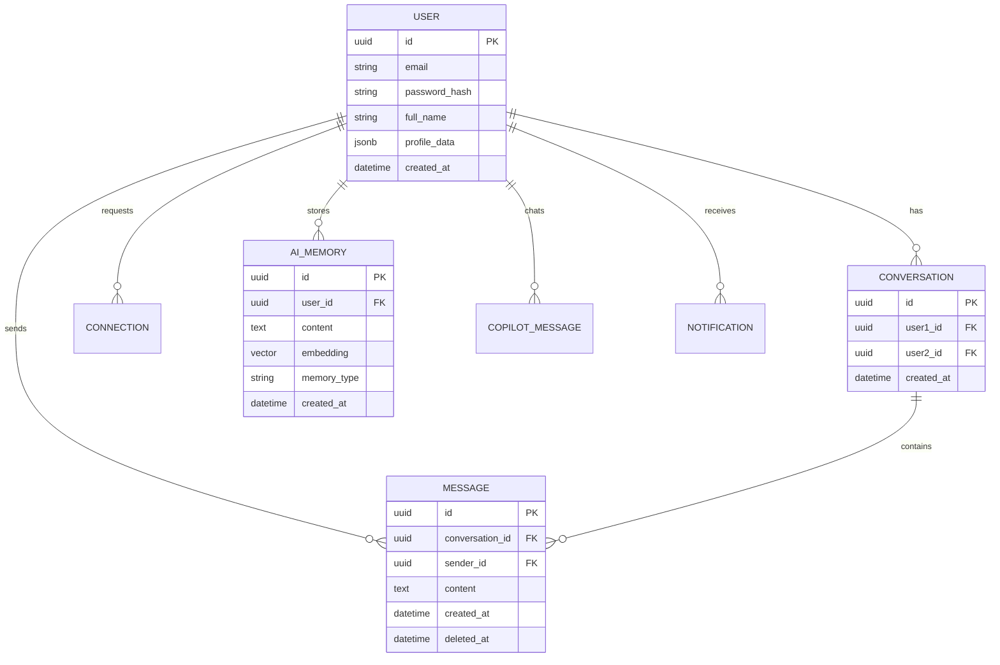
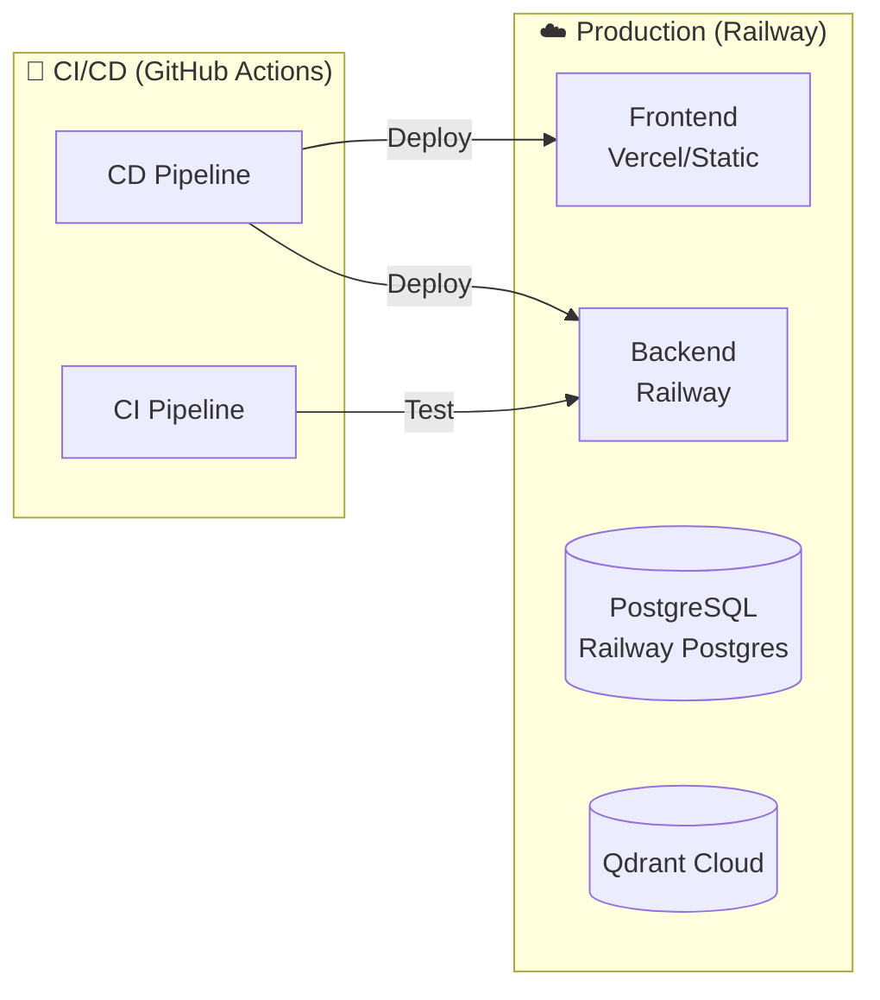
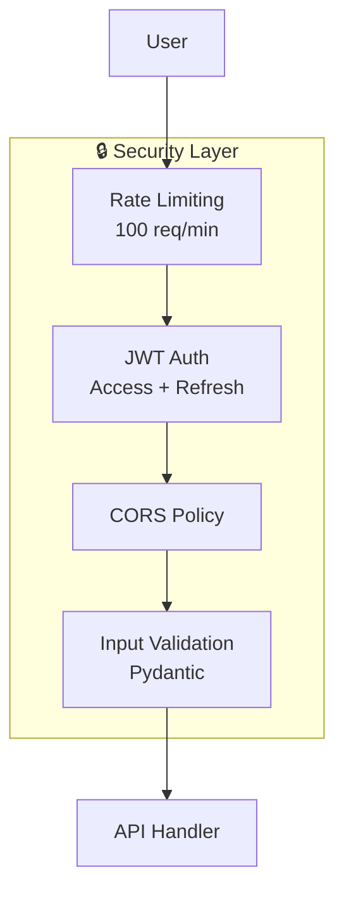

# Architecture Diagram — MemoryChat

## 1. System Overview

---

## 2. Multi-Agent Architecture

---

## 3. Data Flow

---

## 4. Component Details

| Component | Technology | Purpose |
|-----------|------------|---------|
| **Frontend** | Next.js 14, TypeScript, Tailwind CSS | User interface |
| **State** | Zustand, TanStack Query | Client state management |
| **Backend API** | FastAPI, Python 3.11, SQLAlchemy 2.0 | REST endpoints |
| **WebSocket** | FastAPI WebSocket, python-socketio | Real-time messaging |
| **Orchestrator** | LangGraph | Multi-agent coordination |
| **LLM Gateway** | LangChain, OpenAI, OpenRouter | AI inference |
| **Vector Store** | Qdrant Cloud | Semantic memory storage |
| **Database** | PostgreSQL 15, Alembic | Relational data |
| **Workers** | asyncio Background Tasks | Async processing |

---

## 5. Database Schema Overview

---

## 6. Deployment Architecture

---

## 7. Security Architecture

---

## 8. Key Files Reference

| File | Description |
|------|-------------|
| `src/main.py` | FastAPI application entry point |
| `src/agents/` | LangGraph agent definitions |
| `src/api/` | REST API routers |
| `src/models/` | SQLAlchemy database models |
| `src/services/` | Business logic services |
| `src/core/` | Security, config, middleware |
| `alembic/versions/` | Database migrations |
| `tests/` | Test suite |
